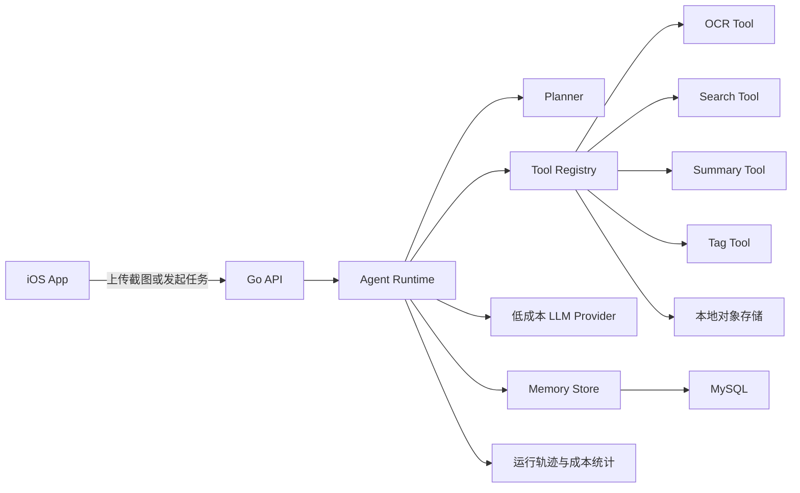
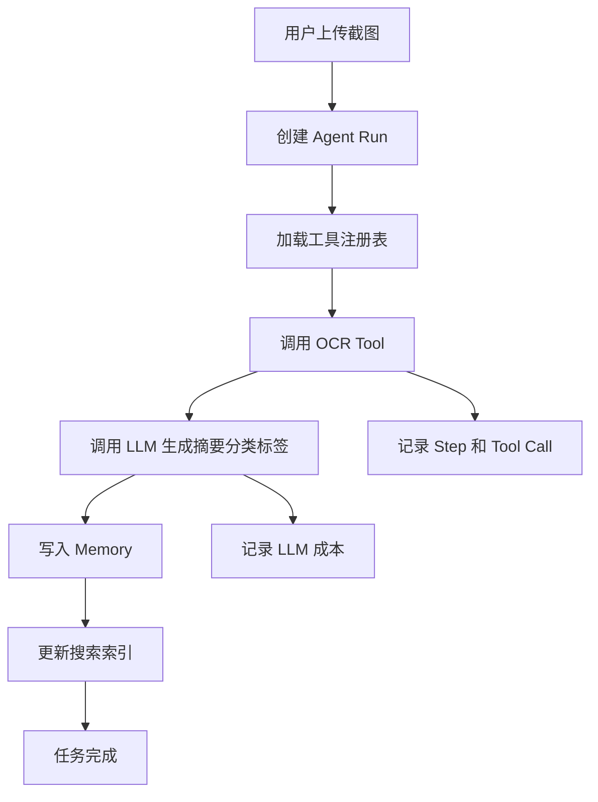

# Go 企业级 Agent MVP 实施计划

## 项目定位

本项目的核心目标不是只做一个截图搜索工具，而是通过 CapSnap 这个具体业务场景，学习和落地一个企业级 Agent 系统。

截图搜索是第一个业务场景，Agent 能力才是主线。v0.1 就要具备：

- Agent Runtime：能够接收任务、规划步骤、调用工具、保存状态。
- Tool Calling：把 OCR、搜索、摘要、分类、存储都封装成工具。
- Memory：把截图、OCR 文本、摘要、标签、任务结果和用户反馈沉淀到 MySQL。
- LLM Provider：接入真实低成本 LLM，用于分类、摘要、标签和下一步决策。
- Observability：记录每次 Agent Run、LLM 调用、工具调用、耗时、错误和成本。
- Workflow：支持异步任务、重试、失败恢复和后续扩展。

## 总体架构

采用 iOS SwiftUI 客户端 + Go Agent 后端。iOS App 负责图片选择、上传、搜索界面和结果展示；Go 后端负责 Agent 编排、工具执行、LLM 调用、OCR、MySQL 持久化和搜索接口。

v0.1 开发阶段先把上传图片存到本地磁盘，同时保留存储接口抽象，后续可以平滑迁移到 S3、R2 或 MinIO。

## 工程语言规范

本项目实现过程中生成的所有非代码文件和代码注释统一使用中文，包括：

- README、技术方案、接口文档、开发说明、测试说明。
- 数据库迁移文件中的注释。
- Go、Swift 代码里的必要注释。
- 配置样例中的说明性注释。

代码标识符、接口路径、数据库字段、环境变量、日志字段名仍使用英文，保持工程通用性。

## 推荐技术栈

- 后端：Go，优先使用 `net/http` 或 `chi`，结构化日志，环境变量配置。
- 数据库：MySQL 8，配合迁移工具管理表结构。
- 数据访问：`sqlc` 或 `sqlx`；如果更重视编译期 SQL 安全，优先选 `sqlc`。
- Agent Runtime：自研轻量运行时，先不引入复杂框架，重点学习企业级 Agent 的核心结构。
- LLM Provider：抽象统一接口，优先接入便宜模型；可选 Qwen、Gemini Flash、GPT mini 系列。具体模型通过配置切换。
- OCR：先定义 `OCRProvider` 接口，再接入开源服务端 OCR。优先尝试 PaddleOCR 的 ONNX/Go 封装；如果部署复杂或不稳定，使用 `gosseract` + Tesseract 作为低成本兜底方案。
- 搜索：第一版先用 MySQL `FULLTEXT` 搜索 OCR 文本，并按时间做简单排序。如果中文分词效果不够，再增加 n-gram 搜索列。
- 可观测性：第一阶段先用 MySQL 记录运行轨迹和成本，后续再接 OpenTelemetry、Prometheus 或日志平台。

## v0.1 范围

v0.1 的目标是做出第一个可运行的截图整理 Agent，而不是只做 OCR 搜索。

用户上传截图后，后端创建一个 Agent Run：

1. Agent 接收任务：整理这批截图。
2. Agent 调用 OCR 工具提取文字。
3. Agent 调用 LLM，根据 OCR 文本生成摘要、分类和标签。
4. Agent 把结果写入 MySQL Memory。
5. Agent 记录完整运行轨迹，包括每一步工具调用、模型调用、耗时、错误和成本。
6. 用户可以搜索截图，也可以查看 Agent 为什么这样分类和总结。

v0.1 暂不做：

- 自动扫描截图相簿。
- iOS 后台同步。
- 用户账号、订阅、云同步、分享。
- 多 Agent 协作。
- 长期自主任务调度。
- 复杂 Planner 和反思机制。

## 后端模块

- `cmd/api`：HTTP API 服务入口。
- `cmd/worker`：Agent Worker 入口，后续可以独立部署为单独进程。
- `internal/config`：环境变量配置。
- `internal/db`：MySQL 连接和生成的查询代码。
- `internal/http`：路由、处理器和中间件。
- `internal/storage`：本地文件存储抽象。
- `internal/agent`：Agent Runtime、Run 状态机、Step 执行逻辑。
- `internal/tools`：工具接口、工具注册表、工具调用参数和结果。
- `internal/llm`：LLM Provider、提示词模板、模型配置、成本统计。
- `internal/memory`：截图记忆、任务记忆、用户反馈和检索接口。
- `internal/ocr`：OCR 提供方接口和实现。
- `internal/jobs`：Agent Run 领取、重试和失败处理逻辑。
- `internal/observability`：运行轨迹、日志、耗时、错误和成本记录。
- `migrations`：MySQL 表结构迁移。

## 初始 MySQL 数据模型

创建这些核心表：

- `devices`：v0.1 匿名安装/设备记录。
- `agent_runs`：一次 Agent 任务运行记录，包含任务类型、状态、输入、输出、错误和耗时。
- `agent_steps`：Agent Run 内的步骤记录，包含步骤类型、输入、输出、状态和耗时。
- `tool_calls`：每次工具调用记录，包含工具名称、参数、结果、错误和耗时。
- `llm_calls`：每次模型调用记录，包含模型、提示词、输出、Token 用量、耗时和估算成本。
- `screenshots`：每张上传截图一行，包含状态、原始文件名、存储 key、图片尺寸、可选截图时间和时间戳。
- `ocr_results`：OCR 文本、可选原始 JSON 结果、OCR 提供方、可选置信度。
- `screenshot_insights`：Agent 生成的摘要、分类、标签、置信度和解释。
- `memories`：可复用的长期记忆，例如用户偏好、常见标签、历史修正。

第一版在 OCR 文本和摘要上建立 MySQL `FULLTEXT` 索引。表结构保留 `embeddings` 后续扩展空间，但 v0.1 不强制接向量数据库。

## API 设计

先实现这些接口：

- `POST /v1/devices`：创建或恢复匿名设备身份。
- `POST /v1/screenshots`：以 multipart 方式上传一张或多张截图。
- `POST /v1/agent-runs`：创建一次 Agent 任务，例如整理一批截图。
- `GET /v1/agent-runs/{id}`：查看 Agent Run 状态、步骤、工具调用和模型成本。
- `GET /v1/screenshots`：获取时间线和处理状态。
- `GET /v1/screenshots/{id}`：获取截图详情，包括图片 URL、OCR 文本、摘要、分类、标签和 Agent 解释。
- `GET /v1/screenshots/{id}/image`：为当前设备返回原图。
- `GET /v1/search?q=...`：基于 OCR 文本、摘要和标签做关键词搜索。
- `POST /v1/screenshots/{id}/retry-agent`：重新执行截图整理 Agent。

## 低成本模型策略

v0.1 必须接入真实 LLM，但要控制成本：

- 不直接把图片发给 LLM，默认只把 OCR 文本发给文本模型。
- 每张截图只做一次整理调用，输出摘要、分类、标签和简短解释。
- 所有 LLM 调用必须记录 Token、耗时、模型名称和估算成本。
- Provider 做成可插拔接口，方便切换模型。
- 提示词模板要版本化，便于回放和对比效果。

优先候选：

- Qwen 系列低价文本模型：适合中文分类、标签和摘要。
- Gemini Flash 系列：便宜，适合后续多模态增强。
- GPT mini 系列：作为效果对照或备用 Provider。

第一阶段不追求最强效果，重点是把企业级 LLM 接入、成本记录、失败重试和结果落库跑通。

## Agent 执行流程

v0.1 的 Agent 可以先是固定工作流，不需要复杂自主规划。企业级价值体现在运行时抽象、工具化、状态机、可观测性和可扩展性。

## 实施顺序

1. 搭建 Go 后端、MySQL 配置、迁移工具和健康检查接口。
2. 设计 Agent Runtime、Run 状态机、Step 模型和工具注册表。
3. 设计 MySQL 表：`agent_runs`、`agent_steps`、`tool_calls`、`llm_calls`、`screenshots`、`ocr_results`、`screenshot_insights`。
4. 实现本地文件存储和截图上传接口。
5. 实现 OCR Tool 和 OCR Provider。
6. 实现 LLM Provider、提示词模板、模型配置和成本统计。
7. 实现 ScreenshotOrganizerAgent：OCR、摘要、分类、标签、解释、落库。
8. 实现 Agent Worker，支持领取任务、执行步骤、失败重试和状态恢复。
9. 实现 Agent Run 查询接口，让前端能看到处理步骤、错误和成本。
10. 实现截图时间线、详情、搜索和重新执行 Agent 接口。
11. 搭建 iOS SwiftUI 应用，包含截图选择、上传、Agent 处理状态、搜索和详情页。
12. 使用 20-50 张真实截图测试 Agent 整理质量、模型成本和搜索效果。

## 第一个交付物

第一个实际里程碑先做后端 Agent 垂直切片：

- 本地运行 MySQL。
- 启动 Go API 和 Agent Worker。
- 通过 curl 或轻量测试客户端上传一张截图。
- 后端创建 `screenshot_organize` 类型的 Agent Run。
- Agent 调用 OCR Tool 提取文字。
- Agent 调用真实低成本 LLM 生成摘要、分类、标签和解释。
- MySQL 能看到 Agent Run、Step、Tool Call、LLM Call 和最终 Insight。
- 搜索接口能通过截图里的文字、摘要或标签返回这张截图。

这个闭环跑通后，这个项目就不只是截图搜索应用，而是一个可以继续扩展业务场景的 Agent 后端系统。
